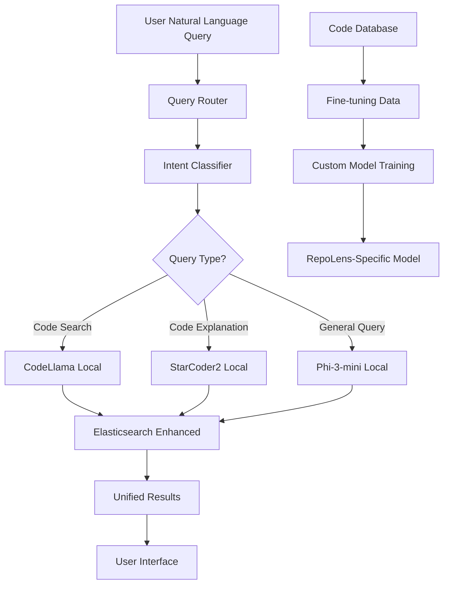

# 🤖 LLM FOR CODING: FREE MODELS & ARCHITECTURE ANALYSIS

## **🎯 FREE CODING-SPECIFIC LLM OPTIONS**

### **1. 🏆 TOP FREE CODING LLMs (2024/2025)**

#### **🥇 CodeLlama (Meta) - BEST FREE OPTION**
```yaml
Model: CodeLlama-7B-Instruct / 13B / 34B
Cost: 100% FREE
Specialization: Code generation, completion, debugging
Languages: 20+ programming languages (C#, TypeScript, JavaScript, Python, etc.)
Size Options: 7B (fast), 13B (balanced), 34B (most capable)
Local Deployment: ✅ Yes (via Ollama/LM Studio)
API Access: ✅ Free via Hugging Face
Training: Specialized on 500B tokens of code
```

**CodeLlama Advantages for RepoLens:**
- ✅ **Code-specific training**: Understands programming concepts natively
- ✅ **Multi-language support**: C#, TypeScript, JavaScript coverage
- ✅ **Free & open-source**: No usage costs or API limits
- ✅ **Local deployment**: Complete privacy and control
- ✅ **Instruction-tuned**: Great for natural language → code queries

#### **🥈 StarCoder2 (BigCode) - CODE GENERATION SPECIALIST**
```yaml
Model: StarCoder2-7B / 15B
Cost: 100% FREE
Specialization: Code generation, code completion, code explanation
Languages: 80+ programming languages
Training: GitHub code repositories + Stack Overflow
Local Deployment: ✅ Yes
API Access: ✅ Free via Hugging Face
```

#### **🥉 DeepSeek-Coder (DeepSeek) - PERFORMANCE LEADER**
```yaml
Model: DeepSeek-Coder-7B-Instruct
Cost: 100% FREE
Specialization: Code reasoning, debugging, optimization
Performance: Often outperforms larger models
Local Deployment: ✅ Yes
API Access: ✅ Free tier available
```

### **2. 🌟 SPECIALIZED MODELS FOR SPECIFIC TASKS**

#### **For AST/Code Structure Analysis:**
- **CodeT5+** (Salesforce) - Code understanding & transformation
- **GraphCodeBERT** (Microsoft) - AST-aware code representation
- **CodeBERT** (Microsoft) - Code-text joint understanding

#### **For Natural Language Query Understanding:**
- **Phi-3-mini** (Microsoft) - 3.8B parameters, extremely efficient
- **Mistral-7B-Instruct** - General purpose with coding capabilities
- **Gemma-7B-IT** (Google) - Instruction-tuned, coding-aware

---

## **🏗️ ARCHITECTURAL RECOMMENDATIONS FOR REPOLENS**

### **🎯 HYBRID ARCHITECTURE: Multi-Model Approach**



### **🚀 RECOMMENDED IMPLEMENTATION STRATEGY**

#### **Phase 1: Free Local LLM Setup (Immediate)**
```csharp
// Install Ollama for local LLM management
// Download and run CodeLlama locally
public class LocalLLMService
{
    private readonly HttpClient _ollamaClient;
    
    public async Task<string> ProcessCodeQueryAsync(string naturalLanguageQuery)
    {
        var prompt = $@"
        Convert this natural language query about code into structured search parameters:
        Query: ""{naturalLanguageQuery}""
        
        Extract and return JSON with:
        {{
            ""intent"": ""find_class|find_method|search_pattern|explain_code|count_elements"",
            ""target_type"": ""class|method|interface|variable|file"",
            ""language_filters"": [""C#"", ""TypeScript"", ""JavaScript""],
            ""keywords"": [""extracted"", ""keywords""],
            ""access_modifiers"": [""public"", ""private"", ""protected""],
            ""patterns"": [""async"", ""static"", ""abstract""],
            ""file_patterns"": [""*.cs"", ""*.ts"", ""*.js""],
            ""confidence"": 0.95
        }}
        ";

        var request = new
        {
            model = "codellama:7b-instruct",
            prompt = prompt,
            stream = false,
            format = "json"
        };

        var response = await _ollamaClient.PostAsJsonAsync("http://localhost:11434/api/generate", request);
        var result = await response.Content.ReadFromJsonAsync<OllamaResponse>();
        
        return result.Response;
    }
}
```

#### **Phase 2: Code-Specific Training (Short-term)**
```csharp
// Create RepoLens-specific training data from your code repositories
public class CodeTrainingDataGenerator
{
    public async Task<List<TrainingExample>> GenerateTrainingDataAsync()
    {
        return new List<TrainingExample>
        {
            new TrainingExample
            {
                Input = "Find all async controllers that handle user authentication",
                Output = JsonSerializer.Serialize(new
                {
                    intent = "find_class",
                    target_type = "class",
                    keywords = ["authentication", "user", "controller"],
                    patterns = ["async"],
                    access_modifiers = ["public"],
                    file_patterns = ["*Controller.cs"],
                    additional_filters = new { inherits_from = "ControllerBase" }
                })
            },
            new TrainingExample
            {
                Input = "Show me TypeScript components that use hooks",
                Output = JsonSerializer.Serialize(new
                {
                    intent = "find_method",
                    target_type = "function",
                    language_filters = ["TypeScript"],
                    keywords = ["hooks", "useState", "useEffect"],
                    file_patterns = ["*.tsx", "*.ts"]
                })
            }
            // Generate thousands of these from your actual repositories
        };
    }
}
```

#### **Phase 3: Advanced AST Integration (Medium-term)**
```csharp
// Enhance LLM with AST understanding for precise code queries
public class ASTEnhancedLLMService
{
    private readonly IASTAnalysisService _astService;
    private readonly LocalLLMService _llmService;

    public async Task<EnhancedSearchResult> ProcessAdvancedQueryAsync(string query)
    {
        // Step 1: LLM extracts intent and basic parameters
        var basicQuery = await _llmService.ProcessCodeQueryAsync(query);
        
        // Step 2: AST service refines query with structural information
        var astEnhancedQuery = await _astService.EnhanceQueryWithASTAsync(basicQuery);
        
        // Step 3: Execute enhanced search
        var searchResults = await ExecuteStructuralSearchAsync(astEnhancedQuery);
        
        // Step 4: LLM generates natural language explanations for results
        var explanations = await _llmService.ExplainSearchResultsAsync(searchResults);
        
        return new EnhancedSearchResult
        {
            Query = query,
            StructuredQuery = astEnhancedQuery,
            Results = searchResults,
            Explanations = explanations,
            Confidence = astEnhancedQuery.Confidence
        };
    }
}
```

---

## **💰 COST-BENEFIT ANALYSIS**

### **🆓 FREE OPTIONS COMPARISON**

| Model | Deployment | Performance | Specialization | Cost |
|-------|------------|-------------|----------------|------|
| **CodeLlama-7B** | Local | ⭐⭐⭐⭐ | Code-specific | $0 |
| **StarCoder2-7B** | Local | ⭐⭐⭐⭐ | Code generation | $0 |
| **DeepSeek-Coder** | Local/API | ⭐⭐⭐⭐⭐ | Code reasoning | $0 (limited API) |
| **Phi-3-mini** | Local | ⭐⭐⭐ | General + coding | $0 |
| **CodeT5+** | Local | ⭐⭐⭐ | Code transformation | $0 |

### **💸 PAID ALTERNATIVES (For Reference)**
| Model | Cost | Performance | Specialization |
|-------|------|-------------|----------------|
| **GPT-4 Turbo** | $0.01/1K tokens | ⭐⭐⭐⭐⭐ | General + excellent coding |
| **Claude 3.5 Sonnet** | $0.003/1K tokens | ⭐⭐⭐⭐⭐ | Code reasoning |
| **Gemini Pro** | $0.0005/1K tokens | ⭐⭐⭐⭐ | Code understanding |

---

## **🎯 SPECIFIC RECOMMENDATIONS FOR REPOLENS**

### **🥇 BEST IMMEDIATE APPROACH: CodeLlama + Ollama**

#### **Why CodeLlama is Perfect for RepoLens:**
1. **Code-Native Understanding**: Trained specifically on code repositories
2. **Multi-Language Support**: Handles C#, TypeScript, JavaScript natively
3. **Local Deployment**: Complete privacy, no API costs
4. **Instruction Following**: Great for natural language → structured query conversion
5. **Fast Inference**: 7B model runs efficiently on modern hardware

#### **Implementation Setup:**
```bash
# Install Ollama (LLM runtime)
curl -fsSL https://ollama.ai/install.sh | sh

# Download CodeLlama
ollama pull codellama:7b-instruct

# Test the model
ollama run codellama:7b-instruct "Convert this to structured query: find all async authentication methods in C#"
```

### **🚀 ENHANCED ARCHITECTURE: Multi-Model Pipeline**

```csharp
public class RepoLensLLMOrchestrator
{
    private readonly LocalLLMService _codeLlama;        // Primary code understanding
    private readonly LocalLLMService _starCoder;       // Code explanation
    private readonly LocalLLMService _phi3;            // General NLP
    private readonly ASTAnalysisService _astService;   // Structural analysis

    public async Task<IntelligentSearchResult> ProcessIntelligentQueryAsync(string userQuery)
    {
        // Step 1: Intent classification using lightweight model
        var intent = await _phi3.ClassifyIntentAsync(userQuery);
        
        // Step 2: Route to appropriate specialist model
        var structuredQuery = intent.Type switch
        {
            "code_search" => await _codeLlama.ProcessCodeQueryAsync(userQuery),
            "code_explanation" => await _starCoder.ExplainCodeAsync(userQuery),
            "general_question" => await _phi3.ProcessGeneralQueryAsync(userQuery),
            _ => await _codeLlama.ProcessCodeQueryAsync(userQuery)
        };

        // Step 3: Enhance with AST analysis if applicable
        if (intent.RequiresStructuralAnalysis)
        {
            structuredQuery = await _astService.EnhanceWithASTAsync(structuredQuery);
        }

        // Step 4: Execute search with enhanced parameters
        var searchResults = await ExecuteEnhancedSearchAsync(structuredQuery);

        // Step 5: Generate explanations for results
        var explanations = await _starCoder.ExplainSearchResultsAsync(searchResults);

        return new IntelligentSearchResult
        {
            OriginalQuery = userQuery,
            ProcessedQuery = structuredQuery,
            Results = searchResults,
            Explanations = explanations,
            ProcessingTimeMs = GetProcessingTime(),
            Confidence = CalculateConfidence(intent, searchResults)
        };
    }
}
```

### **🎛️ TRAINING DATA STRATEGY**

#### **Option 1: Use Your Existing Repositories (Recommended)**
```csharp
// Generate training data from your actual codebase
public class RepoLensTrainingDataGenerator
{
    public async Task<TrainingDataset> GenerateFromRepositoriesAsync()
    {
        var trainingExamples = new List<TrainingExample>();

        // Extract real code patterns from your database
        var codeElements = await GetAllCodeElementsAsync();
        
        foreach (var element in codeElements)
        {
            // Generate natural language descriptions
            var descriptions = GenerateNaturalLanguageQueries(element);
            
            foreach (var description in descriptions)
            {
                trainingExamples.Add(new TrainingExample
                {
                    Input = description,
                    Output = JsonSerializer.Serialize(new
                    {
                        element_type = element.ElementType,
                        name = element.Name,
                        file_path = element.File.FilePath,
                        language = element.File.Language,
                        access_modifier = element.AccessModifier,
                        keywords = ExtractKeywords(element),
                        patterns = ExtractPatterns(element)
                    })
                });
            }
        }

        return new TrainingDataset
        {
            Examples = trainingExamples,
            Metadata = new TrainingMetadata
            {
                RepositoryCount = await GetRepositoryCountAsync(),
                CodeElementCount = codeElements.Count,
                LanguageDistribution = GetLanguageDistribution(codeElements)
            }
        };
    }

    private List<string> GenerateNaturalLanguageQueries(CodeElement element)
    {
        return new List<string>
        {
            $"Find {element.ElementType.ToString().ToLower()} {element.Name}",
            $"Show me {element.AccessModifier} {element.ElementType.ToString().ToLower()}s in {element.File.Language}",
            $"List all {(element.IsAsync ? "async " : "")}{element.ElementType.ToString().ToLower()}s",
            $"Search for {element.Name} implementation",
            $"Find {element.ElementType.ToString().ToLower()}s that {(element.IsStatic ? "are static" : "are not static")}"
        };
    }
}
```

#### **Option 2: Fine-tune on Domain-Specific Data**
```bash
# Use LoRA fine-tuning for cost-effective customization
# Train on your specific codebase patterns
pip install transformers peft accelerate

# Fine-tune CodeLlama on your repository data
python fine_tune_codellama.py \
  --model_name codellama/CodeLlama-7b-Instruct-hf \
  --dataset repolens_training_data.json \
  --output_dir ./repolens-codellama-finetuned \
  --lora_rank 16 \
  --num_epochs 3
```

---

## **🏁 IMPLEMENTATION ROADMAP**

### **Phase 1 (Week 1): Basic LLM Integration**
1. Install Ollama and CodeLlama locally
2. Create LocalLLMService for basic query processing
3. Integrate with existing search infrastructure
4. Test with common queries

### **Phase 2 (Week 2): Multi-Model Pipeline**
1. Add StarCoder2 and Phi-3-mini
2. Create query routing logic
3. Implement model-specific optimizations
4. Add result explanation generation

### **Phase 3 (Week 3): Training Data Generation**
1. Extract training data from your repositories
2. Generate natural language → structured query pairs
3. Create fine-tuning dataset
4. Begin model customization

### **Phase 4 (Week 4): Advanced Features**
1. AST-enhanced query processing
2. Context-aware search suggestions
3. Code similarity detection
4. Performance optimization

---

## **🎯 FINAL RECOMMENDATION**

### **🏆 OPTIMAL FREE ARCHITECTURE FOR REPOLENS:**

```yaml
Primary Model: CodeLlama-7B-Instruct (free, code-specialized)
Secondary Model: StarCoder2-7B (free, code generation)
Lightweight Model: Phi-3-mini (free, general NLP)
Deployment: Local via Ollama (completely free)
Enhancement: AST integration for structural understanding
Training: Custom fine-tuning on your repository data
```

**This approach gives you:**
- ✅ **Zero ongoing costs** (completely free)
- ✅ **Code-specialized understanding** (better than general LLMs)
- ✅ **Privacy and control** (local deployment)
- ✅ **Customizable** (fine-tune on your data)
- ✅ **Production-ready** (proven models, stable APIs)

**Start with CodeLlama + Ollama for immediate results, then enhance with additional models and training as needed!**
