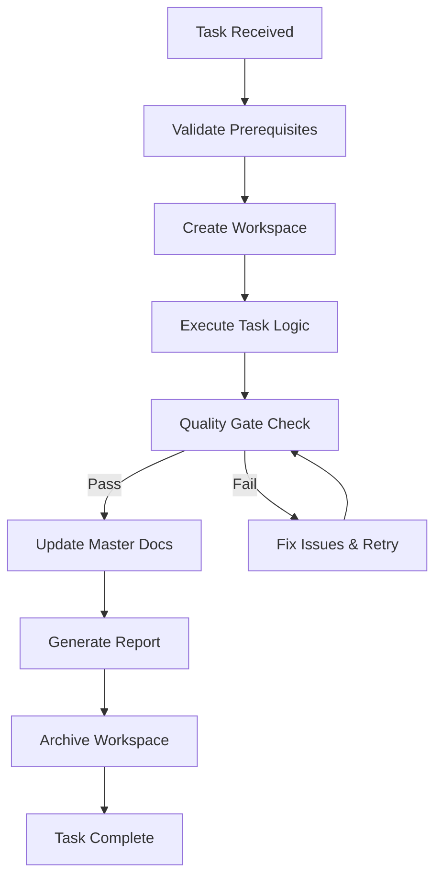
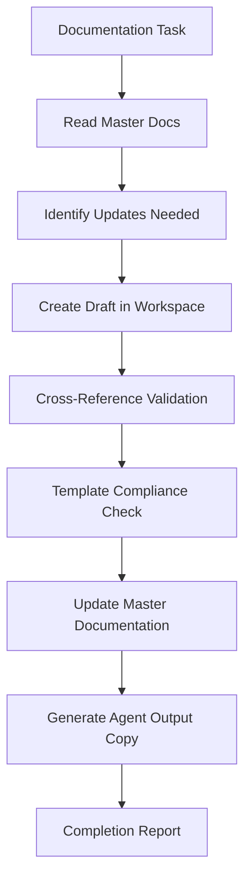
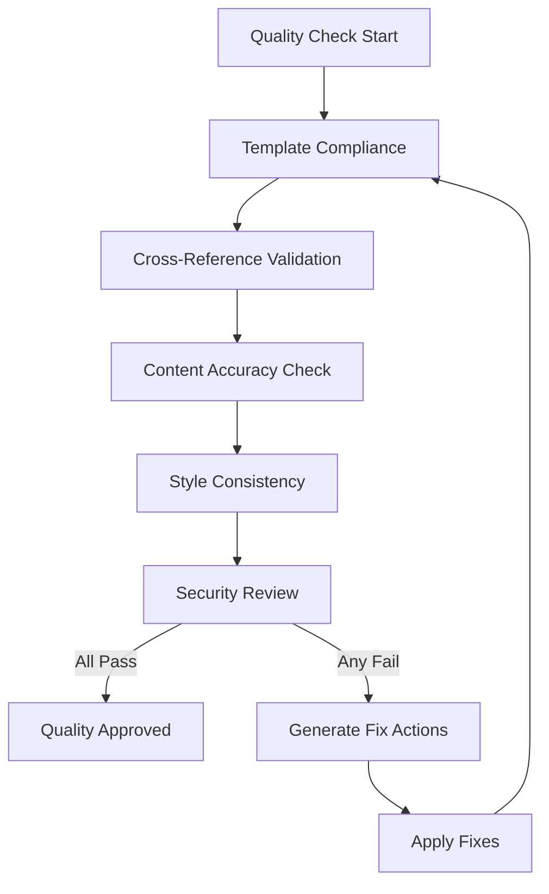

# Agent Workflow Rules and Guidelines

## 🤖 Core Agent Principles

### 1. Documentation-First Approach
- **Every action must update documentation**
- **Master docs in `docs/` take precedence over agent outputs**
- **Agent outputs complement but never replace master documentation**
- **Cross-reference master docs with agent-generated content**

### 2. Quality Gates (Non-Negotiable)
All agents MUST pass these gates before marking tasks complete:

```yaml
quality_gates:
  documentation:
    - template_compliance: REQUIRED
    - cross_reference_validation: REQUIRED
    - master_doc_sync: REQUIRED
  code:
    - syntax_validation: REQUIRED
    - style_compliance: REQUIRED
    - security_scan: REQUIRED
  testing:
    - unit_test_coverage: ">80%"
    - integration_tests: PASS
    - regression_tests: PASS
  review:
    - human_review_required: 
        conditions: ["NEW_API", "BREAKING_CHANGE", "SECURITY_UPDATE"]
    - automatic_approval:
        conditions: ["DOCUMENTATION_UPDATE", "MINOR_FIX", "ROUTINE_MAINTENANCE"]
```

### 3. Workspace Management Rules

#### File Lifecycle
```
agents/workspace/
├── drafts/          # Work in progress (auto-clean after 7 days)
├── scratch/         # Temporary calculations (auto-clean after 1 day)  
├── processing/      # Active tasks (auto-clean after 3 days)
└── archive/         # Completed work (retain 30 days)
```

#### Naming Conventions
```
File Pattern: [AGENT_TYPE]-[TASK_ID]-[TIMESTAMP]-[DESCRIPTION]
Examples:
- DOC-T001-20240115-api-documentation-update.md
- TEST-T005-20240115-unit-test-results.json
- DEPLOY-T010-20240115-production-deployment-log.md
```

## 🔄 Agent Coordination Protocols

### Task Dependencies
```yaml
dependency_check:
  before_start:
    - check_predecessor_tasks_complete
    - validate_resource_availability
    - confirm_no_conflicting_agents
  during_execution:
    - monitor_parallel_tasks
    - watch_for_dependency_changes
    - coordinate_shared_resource_access
  after_completion:
    - notify_successor_tasks
    - update_dependency_graph
    - release_shared_resources
```

### Conflict Resolution
1. **File Conflicts**: Use timestamp-based resolution with merge review
2. **Resource Conflicts**: Queue-based access with priority ordering
3. **Documentation Conflicts**: Master docs always win, agents adapt
4. **Task Conflicts**: Higher priority task gets precedence

### Communication Protocols
```yaml
notifications:
  completion:
    channels: ["agents/outputs/reports/", "team-notifications"]
    format: "agent-completion-report-template.md"
  error:
    channels: ["error-logs", "team-alerts"]  
    escalation: ["immediate", "team-lead", "on-call"]
  status:
    channels: ["status-dashboard", "progress-tracking"]
    frequency: "every-5-minutes"
```

## 📊 Agent Success Metrics

### Primary KPIs
- **Documentation Coverage**: >95% of code must have corresponding docs
- **Cross-Reference Integrity**: 100% of internal links must be valid
- **Template Compliance**: 100% of agent outputs must follow templates
- **Quality Score**: >90% on all quality gate checks
- **Execution Time**: <5 minutes for routine tasks, <30 minutes for complex tasks

### Secondary KPIs  
- **Human Intervention Rate**: <10% of tasks require human review
- **Error Rate**: <5% of agent executions result in errors
- **Resource Efficiency**: <100MB memory usage per agent
- **Knowledge Base Growth**: Documentation volume grows 15% monthly

## 🛡️ Security and Compliance Rules

### Data Handling
```yaml
data_classification:
  PUBLIC: 
    - General documentation
    - Open source code
    - Public API specifications
  INTERNAL:
    - Architecture decisions  
    - Performance metrics
    - Development processes
  CONFIDENTIAL:
    - Security configurations
    - Database schemas
    - Authentication details
    - Customer data (NEVER process)
```

### Access Controls
- **Agents can READ**: All public/internal data
- **Agents can WRITE**: Only to designated agent folders
- **Agents CANNOT**: Access confidential data, modify master docs without review
- **Human Review Required**: Any changes to security-related documentation

### Audit Trail
All agent actions must be logged with:
```yaml
audit_log_entry:
  timestamp: "ISO8601 format"
  agent_id: "unique identifier"
  task_id: "task reference"
  action: "READ/WRITE/DELETE/EXECUTE"
  target: "file/resource path"
  result: "SUCCESS/FAILURE/PARTIAL"
  checksum: "file integrity hash"
  human_reviewed: "boolean"
```

## 🔧 Agent Development Standards

### Agent Code Requirements
```python
class RepoLensAgent:
    def __init__(self):
        self.quality_gates = QualityGateChecker()
        self.workspace = WorkspaceManager()
        self.docs = DocumentationManager()
        
    def execute_task(self, task):
        # 1. Validate prerequisites
        self.validate_prerequisites(task)
        
        # 2. Create workspace
        workspace = self.workspace.create_workspace(task.id)
        
        # 3. Execute with quality gates
        result = self.perform_task_logic(task, workspace)
        
        # 4. Quality validation
        quality_result = self.quality_gates.validate(result)
        
        # 5. Documentation update
        self.docs.update_master_docs(result)
        
        # 6. Generate completion report
        report = self.generate_completion_report(task, result, quality_result)
        
        # 7. Clean up workspace
        self.workspace.archive_and_cleanup(workspace)
        
        return report
```

### Error Handling Standards
```python
def handle_error(self, error, context):
    # 1. Log error with full context
    self.logger.error(f"Agent error: {error}", extra=context)
    
    # 2. Attempt recovery if possible
    if self.can_recover(error):
        return self.attempt_recovery(error, context)
    
    # 3. Create error report
    error_report = self.create_error_report(error, context)
    
    # 4. Escalate if needed
    if error.severity == "HIGH":
        self.escalate_to_human(error_report)
    
    # 5. Clean up partial work
    self.cleanup_partial_work(context)
    
    return error_report
```

## 📋 Agent Workflow Templates

### Standard Task Execution Flow


### Documentation Update Flow


### Quality Assurance Flow


## 🎯 Specific Agent Types

### Documentation Agent
**Responsibilities**:
- Maintain API documentation
- Update technical specifications
- Ensure documentation consistency
- Generate change logs

**Quality Gates**:
- API documentation coverage >95%
- All code examples tested and working
- Documentation builds without warnings
- Cross-references validated

### Code Analysis Agent  
**Responsibilities**:
- Perform static code analysis
- Generate quality reports
- Identify technical debt
- Track complexity metrics

**Quality Gates**:
- Code coverage >80%
- No critical security vulnerabilities
- Complexity metrics within thresholds
- Performance regression checks pass

### Deployment Agent
**Responsibilities**:
- Automate deployment processes
- Monitor deployment health
- Generate deployment reports
- Manage environment configurations

**Quality Gates**:
- All services healthy after deployment
- Database migrations successful
- Performance benchmarks met
- Rollback procedure verified

### Testing Agent
**Responsibilities**:
- Execute automated test suites
- Generate test reports
- Monitor test coverage
- Identify flaky tests

**Quality Gates**:
- All critical tests pass
- Test coverage maintained/improved
- Performance tests within SLA
- No new flaky tests introduced

## 📚 Knowledge Base Management

### Learning and Adaptation
Agents must continuously update their knowledge base:

```yaml
knowledge_updates:
  successful_patterns:
    - Document successful approaches
    - Update best practice guidelines
    - Share learnings across agents
  failure_patterns:
    - Document failure modes
    - Update error handling logic
    - Prevent recurring issues
  optimization_opportunities:
    - Identify inefficient processes
    - Suggest automation improvements
    - Recommend tool upgrades
```

### Continuous Improvement
```yaml
improvement_cycle:
  weekly_review:
    - Analyze agent performance metrics
    - Identify optimization opportunities
    - Update workflow templates
  monthly_assessment:
    - Review quality gate effectiveness
    - Update agent training data
    - Refine automation rules
  quarterly_evolution:
    - Major workflow improvements
    - New agent capability development
    - Architecture refinements
```

---

## ✅ Compliance Checklist

Before any agent deployment, verify:

- [ ] **Documentation**: Agent follows all documentation standards
- [ ] **Security**: Agent passes security review
- [ ] **Testing**: Agent behavior thoroughly tested
- [ ] **Integration**: Agent integrates properly with existing workflows
- [ ] **Monitoring**: Agent has proper logging and monitoring
- [ ] **Recovery**: Agent has error handling and recovery procedures
- [ ] **Performance**: Agent meets performance requirements
- [ ] **Compliance**: Agent follows all organizational policies

---

*This document defines the operational framework for all RepoLens agents. All agents must comply with these rules to ensure consistent, reliable, and secure automation.*
