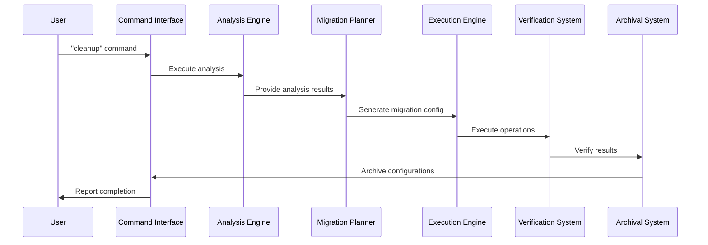
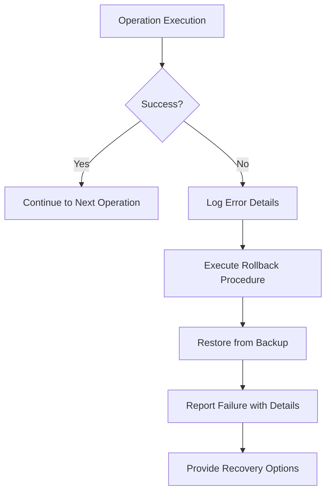

# Autonomous Cleanup Framework - High Level Design (HLD)

## 1. SYSTEM ARCHITECTURE OVERVIEW

### 1.1 Architecture Principles
- **Session Independence**: Framework operates without conversation history
- **Enterprise Safety**: Zero data loss with complete audit trails
- **Modular Design**: Loosely coupled components with clear interfaces
- **Extensibility**: Support for new operation types and analysis patterns

### 1.2 High-Level Component Architecture

```
┌─────────────────────────────────────────────────────────────────┐
│                    AUTONOMOUS CLEANUP FRAMEWORK                 │
├─────────────────────────────────────────────────────────────────┤
│  ┌─────────────────┐    ┌─────────────────┐    ┌──────────────┐ │
│  │   Command       │    │   Analysis      │    │  Migration   │ │
│  │   Interface     │◄──►│   Engine        │◄──►│  Planner     │ │
│  └─────────────────┘    └─────────────────┘    └──────────────┘ │
│           │                       │                     │        │
│           ▼                       ▼                     ▼        │
│  ┌─────────────────┐    ┌─────────────────┐    ┌──────────────┐ │
│  │   Execution     │    │  Verification   │    │   Archival   │ │
│  │   Engine        │◄──►│   System        │◄──►│   System     │ │
│  └─────────────────┘    └─────────────────┘    └──────────────┘ │
├─────────────────────────────────────────────────────────────────┤
│                     ENTERPRISE SAFETY LAYER                    │
│  ┌─────────────────┐    ┌─────────────────┐    ┌──────────────┐ │
│  │   Backup        │    │   Audit Trail   │    │  Rollback    │ │
│  │   System        │    │   Logger        │    │  Manager     │ │
│  └─────────────────┘    └─────────────────┘    └──────────────┘ │
└─────────────────────────────────────────────────────────────────┘
```

## 2. COMPONENT DETAILED DESIGN

### 2.1 Command Interface
**Purpose**: Entry point for framework execution
**Location**: `CLINE-STANDING-INSTRUCTIONS.md`

#### 2.1.1 Responsibilities
- Recognize "cleanup" command trigger
- Initialize framework workflow
- Coordinate component interaction
- Provide status reporting

#### 2.1.2 Key Interfaces
```yaml
Input: User command ("cleanup")
Output: Framework execution status
Dependencies: All framework components
```

### 2.2 Analysis Engine
**Purpose**: Comprehensive project structure analysis
**Location**: `automation/tools/discovery/project-context-scanner.ps1`

#### 2.2.1 Responsibilities
- Directory structure examination
- Technology stack identification (.NET, React, etc.)
- Build artifact detection
- Enterprise compliance evaluation
- Multi-technology repository recognition

#### 2.2.2 Analysis Patterns
```yaml
Technology Detection:
  - Solution files (.sln) → .NET ecosystem
  - Package files (package.json) → Node.js ecosystem
  - Project files (.csproj, .fsproj, .vbproj) → .NET projects
  - Configuration files (tsconfig.json) → TypeScript

Build Artifact Patterns:
  - bin/, obj/ → .NET build outputs
  - node_modules/ → npm dependencies
  - dist/, build/ → Frontend build outputs
  - target/ → Java/Maven outputs

Structure Analysis:
  - Root file appropriateness
  - Technology separation compliance
  - Testing organization patterns
  - Documentation completeness
```

### 2.3 Migration Planner
**Purpose**: Generate detailed migration configurations
**Location**: `automation/workspace/migration-configs/`

#### 2.3.1 Configuration Generation
```json
{
  "migration_name": "Descriptive operation name",
  "operations": [
    {
      "action": "move|archive|create|rename",
      "source": "source path",
      "destination": "destination path", 
      "rationale": "Enterprise business justification",
      "impact": "Change impact assessment"
    }
  ],
  "enterprise_benefits": ["List of business benefits"],
  "required_updates": ["CI/CD, documentation, etc."]
}
```

#### 2.3.2 Operation Types
- **MOVE**: Relocate files/directories with backup
- **ARCHIVE**: Move to legacy with timestamp
- **CREATE**: Generate missing structure/files
- **RENAME**: Change names for clarity/standards
- **UPDATE**: Modify file contents (e.g., .gitignore)

### 2.4 Execution Engine
**Purpose**: Safe operation execution with enterprise protocols
**Location**: `tools/utilities/migration/execute-cleanup-migration.ps1`

#### 2.4.1 Execution Protocol
```
1. Pre-execution validation
2. Complete backup creation
3. Operation-by-operation execution
4. Status logging and progress reporting
5. Error handling and rollback capability
```

#### 2.4.2 Safety Mechanisms
- Complete backup before any changes
- Atomic operation execution
- Comprehensive error logging
- Graceful failure handling
- Rollback procedure availability

### 2.5 Verification System
**Purpose**: Post-operation validation and re-analysis
**Location**: Framework workflow integration

#### 2.5.1 Verification Workflow
```
1. Re-run analysis engine
2. Compare expected vs actual outcomes
3. Identify remaining issues
4. Generate verification report
5. Trigger additional cleanup cycles if needed
```

#### 2.5.2 Quality Checks
- File placement validation
- Structure completeness verification
- Build artifact elimination confirmation
- Enterprise compliance assessment

### 2.6 Archival System
**Purpose**: Configuration and backup management
**Location**: `automation/workspace/processed-configs/`, `legacy/migration-archives/`

#### 2.6.1 Archival Strategy
```yaml
Configuration Archival:
  - Location: automation/workspace/processed-configs/
  - Naming: {config-name}-processed-{timestamp}.json
  - Purpose: Framework operation audit trail

Backup Archival:
  - Location: legacy/migration-archives/
  - Structure: cleanup-{timestamp}/
  - Contents: Complete pre-operation state
  - Purpose: Rollback capability and compliance
```

## 3. DATA FLOW ARCHITECTURE

### 3.1 Primary Workflow


### 3.2 Error Handling Flow


## 4. ENTERPRISE SAFETY ARCHITECTURE

### 4.1 Backup Strategy
```yaml
Backup Creation:
  - Timing: Before any destructive operation
  - Location: legacy/migration-archives/cleanup-{timestamp}/
  - Contents: Complete directory structure and files
  - Verification: Backup integrity validation

Backup Retention:
  - Policy: Retain all backups for audit compliance
  - Organization: Timestamped for chronological tracking
  - Access: Clear restoration procedures documented
```

### 4.2 Audit Trail System
```yaml
Operation Logging:
  - Location: automation/workspace/logs/
  - Format: Structured logging with timestamps
  - Content: Operation details, rationale, outcomes
  - Retention: Permanent for compliance requirements

Configuration Archival:
  - Location: automation/workspace/processed-configs/
  - Naming: Timestamped with operation identifiers
  - Purpose: Complete operation reproducibility
  - Access: Available for analysis and improvement
```

## 5. TECHNOLOGY STACK ARCHITECTURE

### 5.1 Implementation Technologies
```yaml
Core Framework:
  - PowerShell: Primary scripting and execution
  - JSON: Configuration and data exchange
  - Markdown: Documentation and analysis

Integration Points:
  - Git: Version control integration
  - File System: Direct manipulation capabilities
  - Process Management: Command execution and monitoring
```

### 5.2 Extensibility Architecture
```yaml
Analysis Patterns:
  - Modular detection algorithms
  - Configurable technology signatures
  - Extensible evaluation criteria

Operation Types:
  - Plugin-style operation definitions
  - Configurable execution parameters
  - Custom validation rules

Enterprise Policies:
  - Configurable compliance rules
  - Industry standard templates
  - Custom organizational requirements
```

## 6. SCALABILITY AND PERFORMANCE

### 6.1 Performance Characteristics
- **Analysis Speed**: O(n) where n = number of files/directories
- **Execution Time**: Dependent on operation count and file sizes
- **Memory Usage**: Minimal - streaming file operations
- **Storage Impact**: Backup storage proportional to project size

### 6.2 Scalability Considerations
- **Large Repositories**: Parallel operation capability (future enhancement)
- **Multiple Technologies**: Modular analysis engine design
- **Enterprise Scale**: Centralized configuration management
- **Audit Requirements**: Efficient archival and retrieval systems

## 7. SECURITY CONSIDERATIONS

### 7.1 Data Protection
- No sensitive data exposure in logs
- Secure file system operations
- Protected backup locations
- Audit trail integrity

### 7.2 Operation Safety
- Controlled file system access
- Validation before destructive operations
- Complete rollback capabilities
- Enterprise compliance enforcement

## DOCUMENT CONTROL
- **Version**: 1.0
- **Created**: 2026-04-10
- **Type**: High Level Design (HLD)
- **Status**: Implementation Complete
- **Next Review**: Framework enhancement planning
